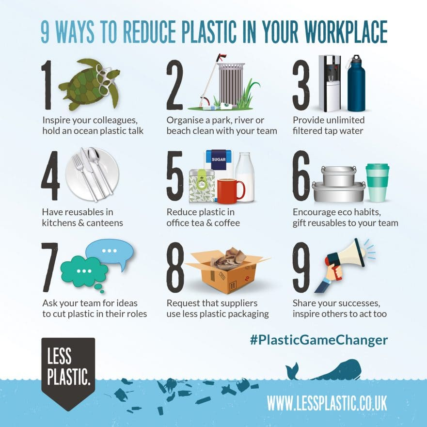

# Protect Us 

  

## ملخص المشروع
- فكرة عامة عن الموقع  
- طريقة عمل الموقع
- التجربة والعرض

## فكرة عامة عن الموقع
فكرة الموقع: نبين أهمية الوعي البيئي وتأثيره على حياتنا ككل، ويساهم هذا النشر للوعي أن ينشأ لنا جيل مثقف وواعي في هذا الموضوع من خلال الاهتمام بالزراعة في البيت مثلا وتعريفه على الهيئة العامة للبيئة والمناطق البيئية   وطرح استبدال أغراضنا بأغراض أخرى صديقة للبيئة.

## طريق عمل الموقع
الموقع مكون من فكرتين رئيسيين (validation, local-Storage)

### Validation
تم عمل تحقيق من صحة المعلومات المدخلة في صفحة ContactUs حتى نتمكن من 
الحصول على المعلومات الصحيحة من المستخدم مثل الاسم، الايميل الالكتروني، 
والرساله المرساله من المستخدم. ستظهر رسالة ان الرساله وصلت بنجاح. وإذا لم يدخل المستخدم اي مدخلات فإنة لايستطيع مراسلتنا. 

### Local-Storage
بهذي الخاصة نستطيع جمع مدخلات المستخدم وتخزينها في local storage ومن 
ثم حفظها في ملف اخر اذا اردنا لنستطيع التواصل مع المستخدمين للموقع.

## الموقع سهل وبسيط الاستخدام
تم استخدام خاصية Loading Page.  
اذهب الى الموقع للتعرف على المحتويات اكثر

## التجربة والعرض
### مرحبا بك في موقعنا <a href="https://protectus.netlify.app">رابط الموقع<a>

<strong>Website screenshots</strong>
 

### الصفحة الرئيسية 
تشمل هذي الصفحة على بعض المعلومات عن الهيئة العامة للبيئة. أيضا هناك ثلاث صور تحتوي على كلام
حول طبيعة الكويت، مسببات التلوث، حياةأقتصادية، ولكل مها رابط ينقلك للصفعة للتعرف أكثر حول الموضوع.

 
 

### صفحة طبيعة الكويت البيئية
تثمل هذي الصفحة على فيديو تعريفي عن الكويت وبعض المعلومات عن الهيئة العامة للبيئة. أيضا هناك صور بعض من أشهر النباتات والحيوانات في الكويت. أخيرا تحتوي على خريطة الكويت التفاعلية للتعرف على الاماكن المراد الذهاب إليها.

 
 

### صفحة مسببات التلوث
هذي الصفحة تعرف تشرح مشكلة البلاستك وفيديو توضيحي لها. هناك بعض من الصور. وفي الختام يوجد فيديو لبعض الحلول إعادة تدور البلاستك. 

 

### صفحة الحياة الاقتصادية  
 هذي الصفحة تحتوي على فيديو عن اهمية العيش في بيئة صحية أقتصادية وصديقة للبيئة. أيضا هناك العديد من الروابط للتشجيع على أتخاذ هذه الحياة كنمط معيشة.و أخيرا يوجد أستبيان قصير يحتوي على 5 أسئلة يجيب عنها المستخدم. 

 
 

### صفحة التواصل معنا
هذي صفحة لتمكين المستخدم من التواصل معنا وطرح بعض الاقتراحات والاسئلة 

### أفكار للمستقبل
 سنقوم بالمستقبل بربط الموقع بقاعدة البيانات للوصول إلى معلومات المدخلة بشكل أسرع، أيضا سنضيف معلومات أكثر وسيتم ربط الموقع 
 بالجهات الداعمة للبيئة لإتاحة الفرصة للمستخدم بالتفاعل بشكل أكبر. أيضا سنقوم بتضمين روابط للمحلات الصديقة للبيئة 
 في شتى مجالات الحياة العربية منها والعالمية. أيضا سنجعل الموقع يدعم اللغة العربية.

## نشكركم على وقكتم في القراءة والتعرف على مشروعي

 

